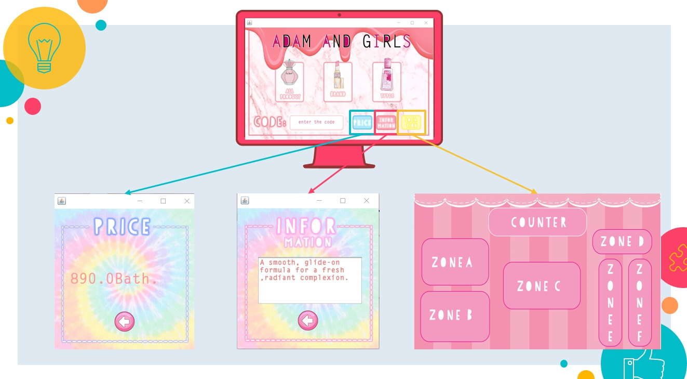

# Application: Cosmetics information & where to find them. 

 
 # Team member
1. Pichaaun Popukdee	6010545862 
2. Thaksina Jansaengsri 	6010545765
 
# Why we do this project? 
We believe that many people have had a problem when you go shopping in superstore or wherever .There are no employees or staff interested in you and can’t service you completely. The simplest example is a cosmetics shop at Siamone underground. Therefore, we just want something that makes us service ourselves easier and this is reason why we do this application .we can find the product with the price and information easily and we don’t have to annoyed with the service that not like service.

 
# Our concepts
  -	We make thing that respond to our own needs.
  -	Useful, comfortable and cute.
  -	Easy to use and understand.

  
# Feature of this program
-	Show all of product in the store 
-	Show the price of the product that you want to know
-	Show the information of the product
-	Show the zone that the product is set.
 
 # How it's work ?
 
This is our first page of project.
Press "click" then it go to the main page.
 

First you have to click the all product button and it will show you the code of all product.
- Brand button tell you all the brand in store.
- Types button tell you all the types in store.

Remember the code and type it in the blank then hit the button on the right of the blank

- First button tell the price.
- Second button tell the information.
- third button tell the location.

